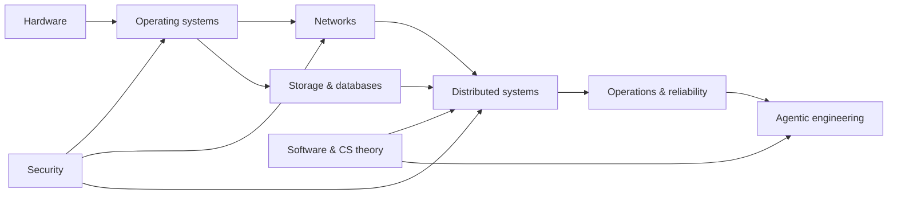

# Engineering Foundations

A public, evolving knowledge base for understanding how software, hardware, and production systems work—and how to engineer effectively with AI agents.

This is not an exam syllabus or a race. It is a place to turn study into durable evidence: explanations, diagrams, experiments, code, references, and better questions.

## Start here

- [12-week Systems Foundations cycle](curriculum/01-systems-foundations.md)
- [Long-term learning roadmap](curriculum/roadmap.md)
- [Standalone learning dependency map](diagrams/learning-dependency-map.html)
- [Study method](curriculum/study-method.md)
- [Topic note template](templates/topic-note.md)
- [Lab template](templates/lab-report.md)
- [Curated resources](resources/reading-list.md)

## Knowledge map

## Repository map

| Path | Purpose |
| --- | --- |
| `curriculum/` | Learning cycles, schedules, and progress reviews |
| `hardware/` | Digital logic, CPU architecture, memory, and devices |
| `software/` | Programming languages, algorithms, and software design |
| `systems/` | Operating systems, networking, storage, databases, and distributed systems |
| `agentic-engineering/` | Model behavior, tool use, context, evaluation, safety, and workflows |
| `notes/` | Cross-cutting notes and glossary |
| `labs/` | Reproducible experiments and small programs |
| `diagrams/` | Diagram source files that do not live beside a note |
| `images/` | Static image assets with attribution where needed |
| `resources/` | Curated books, courses, papers, and documentation |
| `templates/` | Repeatable note, lab, and cycle-review formats |

Prefer Mermaid inside Markdown for editable diagrams. Use SVG or PNG only when Mermaid is insufficient, and keep the editable source beside exported images.

## Learning rule

A major topic is considered studied when it has:

1. A concise explanation in your own words.
2. A diagram or mental model.
3. A small experiment, trace, or code lab.
4. Sources, conclusions, and remaining questions.

Depth matters more than streaks. Missed weeks are resumed, not “caught up.”

## Licensing

Written and visual learning material is available under [CC BY 4.0](LICENSE-CONTENT). Code samples are available under the [MIT License](LICENSE-CODE), unless a file says otherwise.
