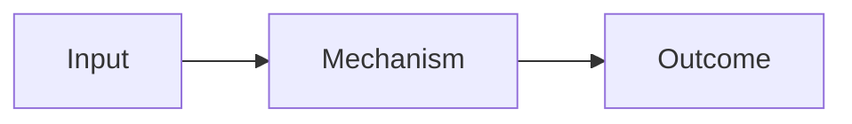

# Topic title

**Status:** seed | studying | explained | revisiting  
**Last reviewed:** YYYY-MM-DD

## Questions

- What do I want to understand?
- What would change my current model?

## Current model

Write the explanation in your own words before and after studying. Preserve important corrections.

## Diagram

## Experiment or example

Describe how someone can reproduce it, including environment, commands, expected observations, and limitations. Put substantial code in `labs/` and link it here.

## Key trade-offs and failure modes

| Choice or condition | Benefit | Cost or risk |
| --- | --- | --- |
| | | |

## What I learned

- Evidence-backed conclusion
- Misconception corrected
- Connection to another topic

## Open questions

- What remains uncertain?
- Which deeper topic belongs on the roadmap?

## Sources

- Author or organization, “Title,” exact section if relevant, URL, accessed YYYY-MM-DD.

